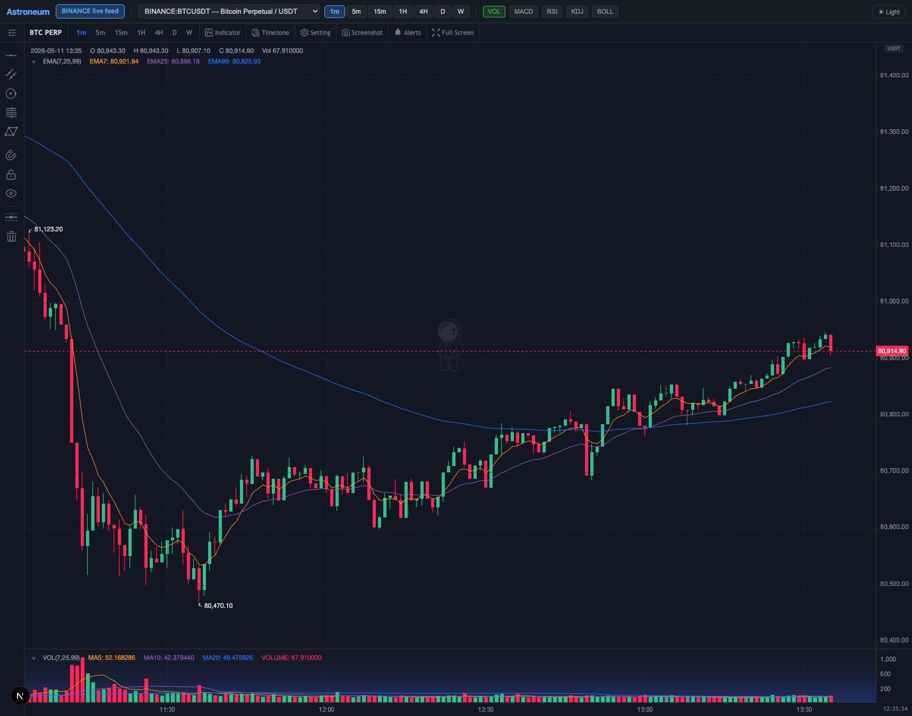
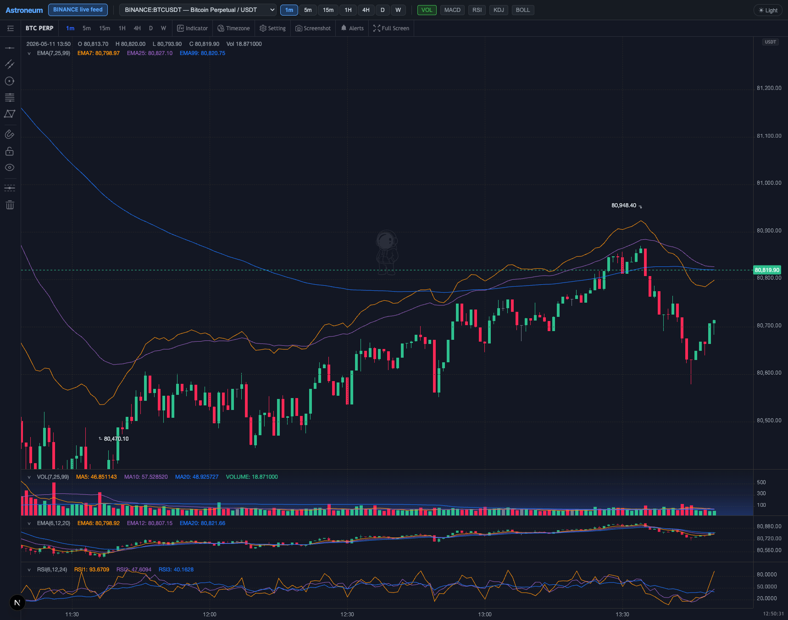

# Astroneum

Professional financial charting library for React applications — now with
TradingView-class features, zero licensing fees, and MIT license.

[](https://www.npmjs.com/package/@tony01/astroneum)
[](https://www.npmjs.com/package/@tony01/astroneum)
[](https://react.dev/)
[](https://www.typescriptlang.org/)
[](https://nodejs.org/)
[](LICENSE)





## Features

### Chart Types
- **Candlestick, OHLC, bar, area, line, Heikin-Ashi** — rendered via Canvas2D / WebGL2 with GPU acceleration
- **Non-time-based bars** — Renko, Kagi, Tick, Range, and Point & Figure generators
- **Multi-chart grid** (2/4/8/16 panes) and **multi-period stacked layout** (e.g. 4H + 1H + 15m)

### Indicators & Analysis
- **50 built-in indicators** — SMA, EMA, MACD, RSI, KDJ, Bollinger Bands, TRIX, SAR, and more
- **Volume Profile** — horizontal histogram with POC, Value Area, and price-level bucketing
- **ZigZag + auto pattern detection** — swing highs/lows, support/resistance clustering
- **Depth of Market** — bid/ask volume ladder visualization
- **Compare/Overlay** — second symbol normalized to percentage on same pane
- **Multi-timeframe indicators** — resample any TF, forward-fill to lower TF bars
- **Custom indicator plugins** via `registerIndicatorPlugin()` with Canvas2D or WebGL2 render path
- **Script editor** — sandboxed Pine-Script–inspired JS environment for custom indicators
- **Deterministic strategy backtesting** — bounded script signal contract, trade/equity/drawdown result types, and a demo report surface; not broker execution

### Drawing Tools
- **20 drawing tools** ? trend lines, Fibonacci (circle, spiral, extension, segment, fan), Gann boxes, pitchforks, Elliott waves, harmonic patterns (ABCD, XABCD), cursor modes, zoom, and **measure/ruler tool**
- **Magnet/Snap** — snap to bar OHLC within 8px, angle snap to 0°/30°/45°/60°/90°
- **Drawing style presets** (7 built-in + custom) with live preview and per-drawing color
- **Undo/Redo** — `UndoManager` with 50-entry depth via Ctrl+Z / Ctrl+Y
- **Copy/Paste drawings** — Ctrl+C/V across charts via clipboard
- **Lock all drawings** toggle
- **Session visualizer** — auto session high/low/open/close lines

### Navigation & UX
- **Keyboard shortcuts** — arrows pan, Page/Home/End scroll/jump, mouse wheel zoom at cursor
- **Crosshair sync** across multi-chart and multi-period layouts
- **Price axis scaling** — linear, log, percentage, indexed-to-100
- **Chart templates** — save/load named configurations to localStorage
- **Accessibility** — `accessible` prop with aria-live OHLCV announcement
- **State serialization** — full chart state persistence & recovery via `serializeState()`/`loadState()`

### Data & Performance
- **Off-main-thread indicator pool** — Web Workers + TypedArray column store
- **OPFS historical cache** — binary bar data persisted to Origin Private File System
- **FlatBuffers binary codec** (`BarsCodec`) — 40 bytes per bar, efficient storage & transfer
- **TickAnimator** — smooth close/high/low interpolation at 60fps
- **TaskScheduler** with priority queue (data > indicator > overlay)
- **SharedArrayBuffer** ring buffer when `crossOriginIsolated`

### Datafeeds
- **StandardCryptoDatafeed** — 100+ symbols, Binance/Bitget/OKX futures, real-time WebSocket
- **DefaultDatafeed & WebSocketDatafeed** — Polygon.io REST + WebSocket
- **WebTransportDatafeed** — experimental HTTP/3 QUIC support
- **BYO datafeed** — 4-method interface (`searchSymbols`, `getHistoryData`, `subscribe`, `unsubscribe`)

### Developer Experience
- **Fully typed TypeScript** — branded financial types (`Price`, `Volume`, `Timestamp`)
- **10 tree-shakeable subpath exports** — import only what you need
- **18 locale JSON files** ? lazy-loaded on demand, dark/light/high-contrast themes
- **SSR-safe** — `'use client'` on every entry, Next.js App Router compatible
- **MIT license** — no usage limits, no watermark, no "Powered by" branding

---

## Install

```bash
npm install @tony01/astroneum
```

`react` and `react-dom` ≥ 18 are peer dependencies.

## Quick Start

```tsx
import { useMemo, useRef, useState } from 'react'
import {
  AstroneumChart,
  createStandardCryptoDatafeed,
  STANDARD_CRYPTO_SYMBOLS,
  type AstroneumHandle,
  type Period,
  type SymbolInfo,
} from '@tony01/astroneum'
import '@tony01/astroneum/style.css'

export default function App() {
  const chartRef = useRef<AstroneumHandle>(null)
  const datafeed = useMemo(() => createStandardCryptoDatafeed(), [])
  const [symbol] = useState<SymbolInfo>(STANDARD_CRYPTO_SYMBOLS[0])
  const [period] = useState<Period>({ multiplier: 1, timespan: 'hour', text: '1H' })

  return (
    <AstroneumChart
      ref={chartRef}
      symbol={symbol}
      period={period}
      datafeed={datafeed}
      theme="dark"
      subIndicators={['VOL']}
      style={{ width: '100%', height: 560 }}
    />
  )
}
```

## Key Props

| Prop | Type | Description |
|------|------|-------------|
| `symbol` | `SymbolInfo` | Symbol to display |
| `period` | `Period` | Timeframe (1m, 5m, 1H, 4H, D, etc.) |
| `datafeed` | `Datafeed` | Data source (crypto, Polygon, or custom); may implement optional batched `getQuotes` for watchlists |
| `theme` | `string` | `'dark'`, `'light'`, or `'high-contrast'` |
| `barStyle` | `'candle' \| 'heikin_ashi'` | Candle rendering style |
| `priceScale` | `'linear' \| 'log' \| 'percent' \| 'indexed'` | Price axis scale |
| `locale` | `string` | BCP-47 locale (e.g. `'ja-JP'`) |
| `drawingBarVisible` | `boolean` | Show drawing toolbar |
| `mainIndicators` | `IndicatorDef[]` | Main pane indicators |
| `subIndicators` | `string[]` | Sub-pane indicators (`['VOL', 'MACD', 'RSI']`) |
| `plugins` | `ChartPlugin[]` | Custom plugins with lifecycle hooks |
| `accessible` | `boolean` | Screen-reader support |
| `style` / `className` | | Container styling |

## Subpath Exports

```tsx
// Main entry
import { AstroneumChart, DefaultDatafeed } from '@tony01/astroneum'

// Tree-shakeable subpaths
import { createChart }          from '@tony01/astroneum/headless'
import { BarReplay }            from '@tony01/astroneum/replay'
import { MultiChartLayout }     from '@tony01/astroneum/multichart'
import { MultiPeriodLayout }    from '@tony01/astroneum'              // same symbol, stacked periods
import { WatchlistManager }     from '@tony01/astroneum/watchlist' // persisted lists, sort, columns, colors, live snapshots
import { PortfolioTracker }     from '@tony01/astroneum/portfolio'
import { AlertManager }         from '@tony01/astroneum/alerts'
import { ScriptEngine }         from '@tony01/astroneum/script'
import { UndoManager }          from '@tony01/astroneum'
import { ChartTemplateManager } from '@tony01/astroneum'
import { SessionVisualizer }    from '@tony01/astroneum'

// Datafeeds
import { createStandardCryptoDatafeed, STANDARD_CRYPTO_SYMBOLS } from '@tony01/astroneum/datafeeds/crypto'
import { DefaultDatafeed, WebSocketDatafeed }                     from '@tony01/astroneum/datafeeds/polygon'

// Utilities
import { heikinAshi }                     from '@tony01/astroneum'  // OHLC → Heikin-Ashi transform
import { zigzag, detectSupportResistance } from '@tony01/astroneum' // pattern detection
import { resampleBars, forwardFill }      from '@tony01/astroneum'  // multi-TF resampling
import { generateRenko, generateKagi,
         generateTickBars, generateRangeBars,
         generatePointAndFigure }         from '@tony01/astroneum'  // non-time-based bars
import { transformCandles, untransformPrice } from '@tony01/astroneum' // price scale transforms

// Plugins
import { volumeProfilePlugin, domPlugin, zigzagPlugin,
         pointAndFigurePlugin }           from '@tony01/astroneum'  // registerIndicatorPlugin(...)
import { createCompareIndicator }         from '@tony01/astroneum'  // compare symbols overlay
```

## Headless Engine

`@tony01/astroneum/headless` exposes the rendering engine without React,
Astroneum UI, stylesheets, datafeeds, keyboard shortcuts, or network behavior.
The host supplies the container, bars, controls, persistence, and lifecycle.

```ts
import {
  asPrice,
  asTimestamp,
  createChart,
  destroyChart,
  registerBuiltInExtensions,
} from '@tony01/astroneum/headless'

registerBuiltInExtensions()

const chart = createChart(document.getElementById('chart')!)
chart.replaceBars([{
  timestamp: asTimestamp(Date.UTC(2026, 7, 29)),
  open: asPrice(100),
  high: asPrice(105),
  low: asPrice(98),
  close: asPrice(103),
}])

destroyChart(chart)
```

Calling `createChart()` twice with the same container returns the same instance.
`destroyChart()` is idempotent and releases the container for a later mount.
`replaceBars()` requires strictly ascending, finite UTC-millisecond OHLCV data;
`updateBar()` may replace the current last bar or append a newer bar. Invalid data
throws without mutating current bars. Calling either method switches that chart to
host-owned data and detaches any explicitly configured engine data loader.

Built-in indicator and drawing registration is explicit and process-wide. Call
`registerBuiltInExtensions()` once before creating studies or drawings. The
headless entry does not require `style.css`.

Typed `registerIndicatorPlugin()` helpers and raw `registerIndicator()` /
`registerOverlay()` primitives let the host supply study and drawing behavior.
`getViewportState()` returns only versioned bar spacing and right-offset bar count;
`setViewportState()` validates and clamps those fields against current bars and
container geometry. Restore it after bars load. Screenshot export composites the
ordered Canvas2D, WebGL, WebGPU, worker-canvas, and GPU-text layers.

`createStandardCryptoDatafeed()` implements batched watchlist snapshots for Binance, Bitget, and OKX. Custom datafeeds can opt in with `getQuotes(symbols)`; consumers without it continue to work and display unavailable quote values.

## Browser Support

| Browser | Minimum | Notes |
|---------|---------|-------|
| Chrome / Edge | 110+ | Full WebGL2 + OPFS |
| Firefox | 115+ | Full WebGL2 |
| Safari | 16.4+ | Full WebGL2, OPFS on 17+ |
| iOS Safari | 16.4+ | Touch + pinch |

Graceful fallback: no WebGL2 → Canvas2D, no OPFS → in-memory cache, no OffscreenCanvas → main-thread calc.

## Next.js Usage

```ts
// next.config.ts
const nextConfig = { transpilePackages: ['@tony01/astroneum'] }
```

```tsx
// app/layout.tsx
import '@tony01/astroneum/style.css'
```

The library ships with `'use client'` built in — no extra directive needed.

## License

MIT — use it anywhere, no fees, no limits, no branding requirement. The package
retains the upstream copyright notice for Kowit Charoenratchatabhan.
