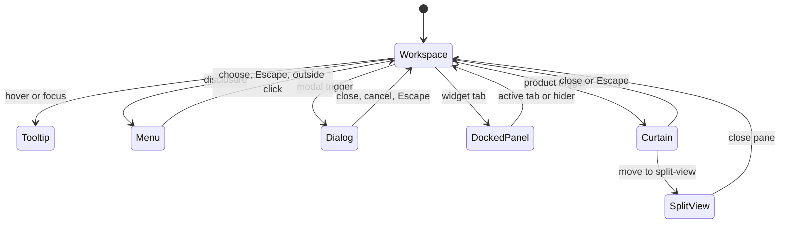
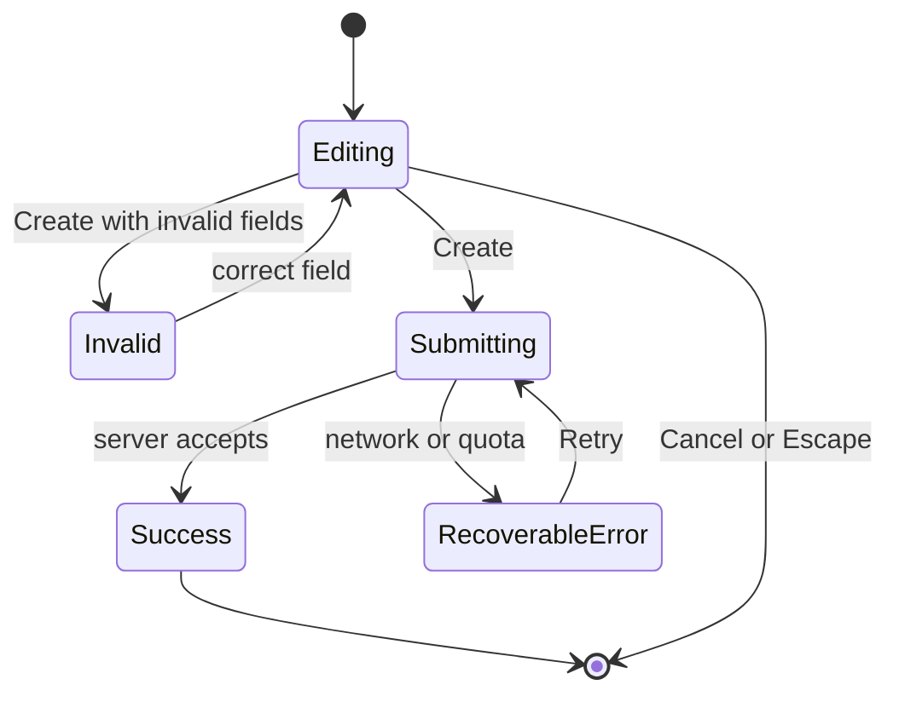

# TradingView Interaction and State Model

> Applies to the essential controls in [tradingview-buttons.md](tradingview-buttons.md).  
> Observed behavior is separated from recommended WCAG AA behavior.

## 1. Interaction principles

- Keep the chart interactive unless a modal dialog requires exclusive input.
- Opening a transient surface closes its peer on the same layer.
- Preserve chart symbol, interval, viewport, drawings, and panel state when opening non-destructive UI.
- Use immediate press feedback; complete most surface transitions in 150–250 ms.
- Escape closes the most recently opened dismissible layer.
- After close, return focus to the trigger unless the action navigated or changed workspace mode.

## 2. Shared control states

| State | Visual/behavior contract | Accessibility contract |
|---|---|---|
| Default | normal contrast and target area | name and role exposed |
| Hover | subtle surface highlight; no layout shift | never the only discovery path |
| Focus-visible | high-contrast focus ring | follows logical tab order |
| Pressed | immediate state layer | `aria-pressed` for toggles |
| Selected | persistent accent/check | `aria-selected` or `aria-checked` |
| Expanded | trigger remains active while surface is open | `aria-expanded=true` and relationship where possible |
| Disabled | reduced emphasis and no activation | native `disabled` or `aria-disabled=true`; reason available |
| Loading | preserve size; block duplicate submission | busy state announced after 300 ms |
| Success | concise confirmation | polite live announcement |
| Error | explain cause and recovery | error relationship and focus recovery |

Icon-only desktop controls may render smaller than 44 px, but their effective pointer target should remain at least 38×38 px in dense mode and expand to 44×44 px for touch.

## 3. Layer and dismissal rules

Priority from back to front:

1. chart canvas;
2. docked/split panels;
3. flyouts and popup menus;
4. modal scrim and dialog;
5. toast;
6. tooltip for the active foreground surface.

Tooltips must not appear behind menus or dialogs. A popup must escape clipping containers and remain within the viewport.

## 4. Top-toolbar flows

### 4.1 Symbol change

1. Activate Symbol.
2. Open Symbol Search and focus the searchbox.
3. Typing filters a virtualized result list.
4. Asset-class tabs scope results without clearing the query.
5. Selecting a result closes the dialog, updates symbol/legend/data, and returns focus to Symbol.

States and edge cases:

- loading: show result skeletons;
- no results: retain query and suggest syntax/market changes;
- delayed data or entitlement: mark the result before selection;
- network failure: keep the dialog open with Retry;
- same symbol: close without resetting viewport unless the exchange changed.

Compare Symbols follows the same search flow but adds a series and preserves the main symbol.

### 4.2 Interval and chart type

The trigger opens an anchored single-selection menu. Arrow keys move through options; Enter selects; Escape restores focus.

On selection:

- update the trigger label and accessible name;
- preserve the visible time anchor where possible;
- show loading only if data fetch exceeds 300 ms;
- announce unavailable or plan-gated options instead of silently ignoring input.

### 4.3 Indicators

The Indicators dialog focuses Search. Navigation categories and type tabs update the result region.

Selecting an indicator:

- applies it to the active pane;
- adds a legend row;
- exposes Hide, Settings, Remove, and More;
- may keep the dialog open for multi-add workflows.

Required failures: no results, permission/paid script, script compile/runtime error, indicator limit, and network failure.

### 4.4 Create alert

Validation appears next to the affected control. Create disables while submitting. Quota, entitlement, invalid condition, and expired-date errors must include a recovery path.

### 4.5 Save and layouts

Save states:

- saved: `All changes saved`, disabled;
- dirty: enabled Save;
- saving: busy, duplicate activation blocked;
- save failed: error with Retry and local changes retained.

Changing chart layout may reflow panes and widget panels. Confirm before discarding pane-specific unsaved work. Checked layout state identifies the active arrangement.

### 4.6 Snapshot

Download/clipboard actions remain in the menu until the operation completes. Success uses a non-modal confirmation. Clipboard denial, blocked download, and image-render failure offer Retry or an alternate action.

## 5. Drawing flows

### 5.1 Tool selection

Activating a direct tool selects it and changes the chart cursor. Completing the drawing returns to Cursor unless Keep drawing is active.

Escape order:

1. cancel the in-progress point/segment;
2. close the tool flyout;
3. return to Cursor.

### 5.2 Tool disclosure

The small disclosure target opens the family flyout without selecting a new tool. The selected row is visually distinct. Favorite and learn-more actions do not select the tool.

### 5.3 Persistent drawing toggles

- Magnet: off / weak / strong / snap-to-indicators options.
- Keep drawing: retains the active tool after completion.
- Lock all: blocks movement/editing but not visibility.
- Hide all: changes visibility without deleting.

Bulk remove actions require clear destructive wording. Locked drawings are preserved unless `Always remove locked drawings` is explicitly active.

## 6. Panels, curtains, and split view

### 6.1 Docked widget panel

Activating a rail button:

- sets that button pressed;
- opens or switches the right panel;
- preserves the previous panel's scroll/filter state;
- keeps the chart operable.

Activating the already-selected rail button or panel hider collapses the panel. Reopening restores width and last subview.

Empty states:

- Alerts: explanation + Create alert;
- Chats: no-message guidance;
- Notifications: explanation + relevant exploration action;
- Watchlist: Add symbol.

The Watchlist panel has a full anatomy, control inventory (`watchlist.list_selector`, `watchlist.add_symbol`, `watchlist.advanced_view`, `watchlist.settings`, `watchlist.column_header`, `watchlist.row`, `watchlist.details_metrics`), sortable-column and quote-state model in [watchlist.md](watchlist.md). Row DOM, the row context menu, list-menu contents, and the News sub-view are `not captured` there.

### 6.2 Product curtain

Screeners, Pine Editor, Calendars, and Community open above the workspace with Close and Move overlay to split-view.

Move to split view:

1. preserve the product's current tab, filters, selection, and scroll;
2. remove the blocking curtain layer;
3. allocate a chart-adjacent pane;
4. expose pane close/collapse and resize behavior;
5. keep both chart and product keyboard-reachable.

If available width is insufficient, the action should be disabled with an explanation or replace the chart temporarily. It must not create an unusably narrow chart.

### 6.3 Screener-specific states

- table/chart view selection;
- filters dirty/applied;
- sort direction;
- column configuration;
- loading/skeleton;
- no matches;
- data failure and Retry;
- fullscreen;
- move to split view.

### 6.4 Pine-specific states

- clean/dirty script;
- saving/saved/save failed;
- compile running/success/errors;
- add-to-chart running/success/failure;
- unpublished/publishing/published;
- unsaved-close confirmation;
- move to split view.

## 7. Chart canvas and context menu

Pointer:

- drag chart to pan;
- wheel/pinch to zoom;
- drag scale to change scale;
- double-click scale to reset where supported;
- right-click to open the chart context menu.

Keyboard alternatives are required for reset view, Go to date, zoom, and object management.

The context menu is pointer-anchored and reflects context:

- price actions include the clicked price;
- order actions depend on broker/account state;
- Paste is disabled when clipboard content is incompatible;
- indicator removal reflects the indicator under context;
- Escape/outside click dismisses without changing chart state.

## 8. Go to, timezone, and range

Go to:

- Date tab selects one date;
- Custom range selects start/end;
- time input enables only when the interval supports intraday precision;
- future/unavailable dates are disabled;
- Go to validates before navigating.

Timezone selection updates labels and the live clock, not underlying timestamps. UTC, Exchange, and named zones are mutually exclusive.

Range shortcuts may change both visible range and interval. Preserve drawings and selected symbol.

## 9. Replay

Replay states:

1. inactive;
2. selecting start date (`header.replay` pressed);
3. active and paused;
4. active and playing;
5. endpoint reached;
6. stopped/realtime.

Active controls: Select date, play/pause, step, speed, endpoint/realtime, Close, and Replay Trading.

Stopping replay restores real-time data and removes replay-only controls. If a simulated order exists, confirm or clearly state what will be discarded.

## 10. Responsive and input edge cases

- Hidden responsive copies must not receive focus or clicks.
- Toolbar overflow preserves Symbol, Interval, Chart type, Indicators, Alert, Replay, and workspace access first.
- Date shortcuts collapse into a menu before clipping.
- Dialogs fit short viewports with internal scrolling and fixed Close/primary actions.
- Flyouts flip or constrain themselves near viewport edges.
- At 200% zoom, controls remain operable and no modal action is unreachable.
- Touch input uses larger hit targets and does not depend on hover.
- Reduced motion uses instant transitions or crossfades.
- Losing network does not discard local chart edits or script text.
- Session expiry preserves local work and offers sign-in recovery.

## 11. Observed versus recommended

Observed TradingView behavior is the fidelity baseline. Recommended improvements include:

- context-specific accessible names for repeated More buttons;
- explicit labels for icon-only dialog actions;
- consistent `aria-expanded` on disclosures;
- visible disabled reasons;
- complete focus restoration;
- accessible text summary/table alternatives for chart data;
- reliable keyboard access to hover-revealed legend actions.
