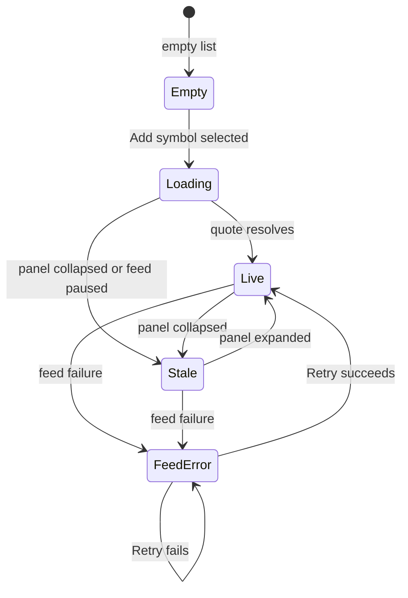

# TradingView Watchlist Right-Panel Reference

> Source: `https://www.tradingview.com/chart/8Wh6yRIo/`
> Live verification: 2026-07-10 (initial), 2026-07-13 (row DOM + section groups via CDP), Chrome CDP, 1920x945 viewport, light theme, BTCUSDT 1D
> Scope: the Watchlist docked widget panel opened from the right widget rail (`sidebar.watchlist` / `[data-name="base"]`)
> Companion documents: [structure.md](structure.md) 2.4, [tradingview-buttons.md](tradingview-buttons.md) 6, [interactions.md](interactions.md) 6.1, [audit-results.md](audit-results.md)

## 1. Purpose and evidence

This document is the implementation-focused behavioral reference for the Watchlist right panel. It expands the single `sidebar.watchlist` row in [tradingview-buttons.md](tradingview-buttons.md) into a full panel anatomy, control inventory, interaction model, and gap list. It does not duplicate the broader widget-rail contract; see [structure.md](structure.md) 2.4 for the rail and the docked/curtain split.

Evidence priority:

1. Live controls captured in `button-scan.json` (2026-07-10 CDP scan).
2. Current visible DOM attributes and accessibility state.
3. `tradingview-live.html` snapshot (the panel body was still loading as a `tv-spinner` when the HTML snapshot was taken, so the row body is `not captured` there).
4. Visual inference from the scan coordinates.

Confidence markers:

- `observed`: confirmed control present in `button-scan.json` with selector and coordinates.
- `inferred`: consistent with the captured header and known TradingView behavior but not directly exercised in this capture.
- `not captured`: known surface without enough current evidence.
- `requires manual verification`: behavior is ambiguous, account-dependent, or risky to exercise.

Coordinates in `button-scan.json` are capture evidence only, not selectors. Hashed CSS-module classes (for example `sortable-PYr1BHmD`, `headerButton-cxaTnjzs`) are evidence of structure, not contracts.

## 2. Panel anatomy

The Watchlist panel is the docked widget panel opened by the right-rail toggle `base` ("Watchlist, details, and news"). From top to bottom it contains:

```text
┌─────────────────────────────────────────────┐
│ List selector (watchlists-button)            │  header toolbar
│                Add symbol | Advanced | Settings │
├─────────────────────────────────────────────┤
│ Symbol | Last | Chg | Chg%   (sortable)      │  column header
├─────────────────────────────────────────────┤
│ <symbol row>                                 │  row list (scrollable)
│ <symbol row>                                 │
│ ...                                          │
├─────────────────────────────────────────────┤
│ Section groups (collapse chevron)            │  optional sections
├─────────────────────────────────────────────┤
│ Details subview: Metrics / More seasonals /  │  Details sub-tab
│ More technicals                              │
└─────────────────────────────────────────────┘
```

The panel co-hosts three sub-views behind the same `base` rail toggle: Watchlist, Details, and News. This capture documents the Watchlist sub-view in full and the Details sub-view partially; News is `not captured`.

### 2.1 Rail toggle

`observed`: the right-rail button `[data-name="base"]` with accessible name "Watchlist, details, and news" opens or focuses the panel. Repeating the active rail target collapses the panel body and retains the rail strip (see [interactions.md](interactions.md) 6.1).

### 2.2 Header toolbar

`observed` header controls, left to right:

- list selector `watchlists-button` (text "Watchlist" with a disclosure chevron);
- `add-symbol-button` ("Add symbol");
- `advanced-view-button` ("Advanced view");
- `settings-button` ("Settings").

### 2.3 Column header

`observed`: four sortable column header buttons using class `sortable-PYr1BHmD`: `Symbol`, `Last`, `Chg`, `Chg%`. A separate collapse chevron (`button-nLcP8GG0`) appears at the section boundary.

### 2.4 Symbol rows

`observed` 2026-07-13 via CDP: the row container is `[data-name="symbol-list-wrap"]` (319x775px observed). Inside a `tree` wrapper (`[data-name="tree"]`) with an overlay scroll wrap and a `listContainer` div holding the rows.

Each symbol row is a plain `<div>` (no `data-name`, no `role`) containing:
- symbol ticker (bold text);
- "Market open" status text;
- last price;
- change (absolute);
- change percent;
- volume (when advanced view is active).

Section group headers appear as non-interactive plain-text divider rows between symbol rows (e.g. "US STOCK"). No `data-name`, no `role`, no chevron — just a text label.

Row right-click menu and per-row hover actions were `not captured` in this pass. Flag/color affordance is `not captured`.

### 2.5 Details sub-view

`observed`: `details-metrics-button` (title "Metrics"), plus text buttons "More seasonals" and "More technicals". The Details sub-view is reached by switching sub-tabs inside the same `base` panel, not by a separate rail target.

## 3. Control inventory

| semantic_id | Control | Selector | Presentation | Necessary nested controls | Confidence |
|---|---|---|---|---|---|
| `sidebar.watchlist` | Watchlist/details/news rail toggle | `[data-name="base"]` | docked panel rail button | list selector, add symbol, advanced view, settings, sortable columns | `observed` |
| `watchlist.list_selector` | List selector / switch list | `[data-name="watchlists-button"]` | header button + dropdown | list names, create/manage lists | `observed` (label and chevron); list menu `not captured` |
| `watchlist.add_symbol` | Add symbol | `[data-name="add-symbol-button"]` | header icon button | opens Symbol Search (see [structure.md](structure.md) 4.1) | `observed`; dialog flow `inferred` |
| `watchlist.advanced_view` | Advanced view toggle | `[data-name="advanced-view-button"]` | header icon button | column preset switch (simple/advanced) | `observed`; presets `inferred` |
| `watchlist.settings` | Settings | `[data-name="settings-button"]` | header icon button | column chooser, list options | `observed`; menu contents `not captured` |
| `watchlist.section_toggle` | Section collapse chevron | hashed class `button-nLcP8GG0` | small chevron button | collapse/expand a section group | `observed` (control only); semantics `inferred` |
| `watchlist.column_header` | Sortable column headers | `.sortable-PYr1BHmD` (hashed) | header label buttons | sort asc/desc indicator | `observed`; sort state `inferred` |
| `watchlist.row` | Symbol row | `[data-name="symbol-list-wrap"]` container | row div | symbol ticker, "Market open" status, last, chg, chg%, volume | `observed` (row DOM + cells); hover actions + context menu `not captured` |
| `watchlist.row_context_menu` | Row right-click actions | `not captured` | context menu | remove, move to list, copy, alert, hide | `not captured` |
| `watchlist.section_group` | Section group header | plain text divider row (no `data-name`) | non-interactive div | group label (e.g. "US STOCK") | `observed` |
| `watchlist.details_metrics` | Details Metrics toggle | `[data-qa-id="details-metrics-button"]` | icon button | metrics grid | `observed` |
| `watchlist.details_more_seasonals` | More seasonals | text button "More seasonals" | link/button | seasonal section expansion | `observed` |
| `watchlist.details_more_technicals` | More technicals | text button "More technicals" | link/button | technicals section expansion | `observed` |

Implementation rule: prefer role + accessible name, then `data-name` / `data-qa-id`, then the normalized `watchlist.*` semantic IDs above. Avoid the hashed classes (`sortable-PYr1BHmD`, `headerButton-cxaTnjzs`, `button-nLcP8GG0`) as selectors; they are evidence only.

## 4. Interaction and state model

### 4.1 Open and close

Activating `sidebar.watchlist`:

- sets that rail button pressed;
- opens or focuses the right panel on the last active sub-view (Watchlist by default);
- preserves the previous panel's scroll and filter state;
- keeps the chart operable.

Activating the already-selected rail target or the panel hider collapses the panel body. Reopening restores width and last sub-view. See [interactions.md](interactions.md) 6.1 for the shared docked-panel contract.

### 4.2 List selection

`observed`: the list selector `watchlists-button` shows the active list name and a disclosure chevron. Activating it opens a list menu (`not captured`) to switch, create, rename, or delete lists. Selecting a list replaces the row set and preserves sort/column state per list.

### 4.3 Add symbol

`observed`: `add-symbol-button` ("Add symbol") opens the Symbol Search dialog documented in [structure.md](structure.md) 4.1. Selecting a result adds the symbol to the active list, fetches its quote, and returns focus to the add-symbol trigger. States required: loading skeletons, no results, delayed/entitlement result marker, network failure with Retry.

### 4.4 Column sort

`observed`: each column header (`Symbol`, `Last`, `Chg`, `Chg%`) is a sortable button. `inferred`: first click sorts ascending, second click descending, third click clears the sort; the active sort column shows a direction indicator. Sort state is persisted per list.

### 4.5 Advanced view and settings

`observed`: `advanced-view-button` ("Advanced view") and `settings-button` ("Settings"). `inferred`: Advanced view toggles between a simple column preset (ticker, last, chg%) and an advanced preset (adding volume, open, and absolute change). Settings opens a column chooser / list options menu. Both states and menu contents are `not captured` and require a focused capture.

### 4.6 Row selection and chart sync

`inferred`: activating a symbol row sets it as the chart's primary symbol, updates the legend and data, and preserves the chart viewport. The selected row is visually distinct (active state) and announced. The exact row DOM, keyboard model, and multi-select behavior are `not captured`.

### 4.7 Row context menu

`not captured`: TradingView watchlist rows expose a right-click menu (remove, move to list, copy ticker, hide, add alert, lock). The menu, its keyboard navigation, and its disabled states were not captured and must be verified before implementation.

### 4.8 Section groups

`observed`: a collapse chevron (`button-nLcP8GG0`) appears at a section boundary. `inferred`: it collapses or expands a grouped row set. The grouping semantics and which sections exist are `not captured`.

### 4.9 Details sub-view

`observed`: the Details sub-view exposes `details-metrics-button` (Metrics) and the "More seasonals" / "More technicals" expansion buttons. It is a sub-tab inside the `base` panel, not a separate rail target. The metrics grid and expansion contents are `not captured`.

### 4.10 Empty state

`observed` intent, `inferred` copy: an empty active list shows an "Add symbol" empty state per [interactions.md](interactions.md) 6.1. The empty-state affordance should be keyboard-reachable and open Symbol Search directly.

### 4.11 Quote states

`inferred`: each row reads a live last/chg/chg% value from a quote feed. Required states: live, stale (feed paused or panel collapsed), delayed/entitlement marker, and feed failure with `—` placeholders and a Retry path. See [interactions.md](interactions.md) 6.3 / 11.9 for the shared recovery contract.



## 5. Selector contract

Preferred selector order for this panel:

1. role + accessible name (for example `button[aria-label="Add symbol"]`);
2. `data-name` (for example `[data-name="add-symbol-button"]`);
3. `data-qa-id` (for example `[data-qa-id="details-metrics-button"]`);
4. normalized `watchlist.*` semantic ID from this document;
5. stable panel region scoped to `[data-name="base"]`.

Avoid:

- hashed class suffixes (`sortable-PYr1BHmD`, `headerButton-cxaTnjzs`, `button-nLcP8GG0`);
- the `button-sXspZNnZ` / `button-HdKhcTye` base classes, which are shared across many controls;
- absolute coordinates from `button-scan.json`;
- text containing live prices or change values.

## 6. Responsive behavior

`inferred` from the shared panel contract in [structure.md](structure.md) 5:

- the panel may close or narrow on constrained widths; the rail toggle remains;
- the header toolbar collapses icon-only before removing controls;
- the column header keeps `Symbol` and `Last` essential; `Chg` / `Chg%` may hide behind a column chooser on narrow widths;
- the row list scrolls vertically; horizontal overflow is absorbed by the column chooser rather than horizontal scroll;
- duplicate responsive DOM variants remain hidden and non-focusable.

Exact breakpoint values are `not captured`.

## 7. Accessibility contract (WCAG 2.2 AA)

Preserve observed labels and order; recommended improvements are separate:

- expose `aria-pressed` on `advanced-view-button` and the section toggle;
- expose `aria-sort` on each sortable column header (`ascending`, `descending`, `none`);
- give the list selector `aria-haspopup="menu"` and `aria-expanded`;
- give the active row `aria-selected` within a `role="listbox"` / `role="row"` structure once the row DOM is captured;
- keep icon-only header targets labelled ("Add symbol", "Advanced view", "Settings", "Metrics");
- return focus to the trigger after Symbol Search, the settings menu, and the list menu close;
- announce quote feed failure and recovery without stealing focus;
- do not rely on hover to reveal row actions; provide a keyboard path to remove/move/copy/alert;
- target 38x38 px dense desktop targets and 44x44 px touch targets for the header icon buttons (the captured header buttons are 38x38).

## 8. Gaps and refresh notes

`not captured` items that need a focused CDP capture before implementation claims:

- row right-click context menu and its actions;
- list selector menu (switch / create / rename / delete / duplicate / export);
- settings menu and column chooser contents;
- advanced-view column presets and their exact columns;
- Details metrics grid and the seasonals/technicals expansion contents;
- News sub-view (entirely `not captured`);
- per-list color dot / flag affordance;
- exact responsive breakpoints and narrow-width column behavior.

`observed` 2026-07-13 CDP — resolved from `not captured`:
- full symbol-row DOM: rows are plain `<div>` inside `[data-name="symbol-list-wrap"]` with ticker, "Market open" status, last, chg, chg%, volume;
- section group semantics: non-interactive plain-text divider rows (e.g. "US STOCK") between symbol rows;
- details buttons: `details-add-note-button`, `details-settings-button`, `details-more-technicals-button` observed.

Refresh guidance: re-run the CDP scan with the Watchlist panel open and a non-empty list, capture the row DOM and the right-click menu, record sort/column state, and update this document plus `button-scan.json` before changing any `observed` contract above. Follow the [README.md](README.md) refresh policy: record date, viewport, account state, symbol, interval, theme, and open panels; exercise only non-destructive interactions; compare semantic attributes before CSS classes.
